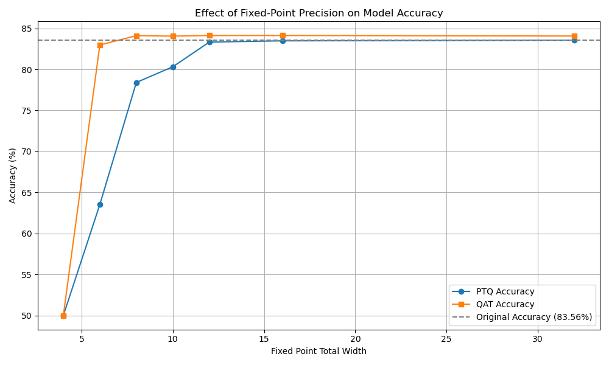

# ADLS Coursework 1

## Lab 0: Introduction to MASE

### Tutorial 1: Introduction to MASE

> **Task**:
> Delete the call to `replace_all_uses_with` to verify that FX will report a `RuntimeError`.

When writing transform passes, which can involve deleting / replacing nodes, we have to ensure we don't leave the graph in an invalid state - e.g. when deleting nodes, have to locate and update all nodes that use their output with `replace_all_uses_with`, otherwise may get a runtime error such as the following:

```plaintext
RuntimeError: Tried to erase Node bert_embeddings_dropout but it still had 6 users in the graph: {getattr_2: None, size_4: None, bert_encoder_layer_0_attention_self_query: None, bert_encoder_layer_0_attention_self_key: None, bert_encoder_layer_0_attention_self_value: None, add_7: None}!
```

### Tutorial 2: LoRA finetune

> **Task**:
> Remove the `attention_mask` and `labels` arguments from the `hf_input_names` list and re-run the following cell. Use `mg.draw()` to visualize the graph in each case. Can you see any changes in the graph topology? Can you explain why this happens?.

No `labels` argument meant there was no CrossEntropyLoss module at the end - need ground truth labels as reference to be able to compute loss. Final output is just the logits from classifier, whereas with with `labels`, output includes loss.

With no `attention_mask`, model assumes that all input positions are fully attended (no positions masked) - so replaced with node where the model generates a tensor filled with ones (`torch.ones`).

| With labels | Without labels |
| --- | --- |
|  |  |

## Lab 1: Model Compression (Quantization and Pruning)

### Tutorial 3: QAT

> **Task**:
> Explore a range of fixed point widths from 4 to 32. Plot a figure where the x-axis is the fixed point width and the y-axis is the highest achieved accuracy on the IMDb dataset, with separate curves for PTQ and QAT at each precision to show the effect of post-quantization finetuning.

The following combinations of widths were tested: `(4,2), (6,3), (8,4), (10,5), (12,6), (16,8), (32,16)`

| total_width | frac_width | PTQ Accuracy (%) | QAT Accuracy (%) | QAT Gain (%) |
|------------|-----------|---------------------|---------------------|------------|
| 4          | 2         | 50.00               | 50.00               | 0.00       |
| 6          | 3         | 63.53               | 82.97               | 19.44      |
| 8          | 4         | 78.40               | 84.11               | 5.70       |
| 10         | 5         | 80.32               | 84.05               | 3.73       |
| 12         | 6         | 83.32               | 84.12               | 0.80       |
| 16         | 8         | 83.48               | 84.13               | 0.65       |
| 32         | 16        | 83.56               | 84.06               | 0.51       |

- At low bit widths, quantisation degrades accuracy significantly.
- QAT greatly helps recover lost accuracy, especially for lower bit widths (<=10). 
- Beyond a certain precision (approx 12 bits), both PTQ and QAT nearly match the original accuracy.
- Sweet spot of quantisation and accuracy seems to be at bit width = 8, with QAT, at which point we already surpass original accuracy of 83.56%.



### Tutorial 4: Pruning

