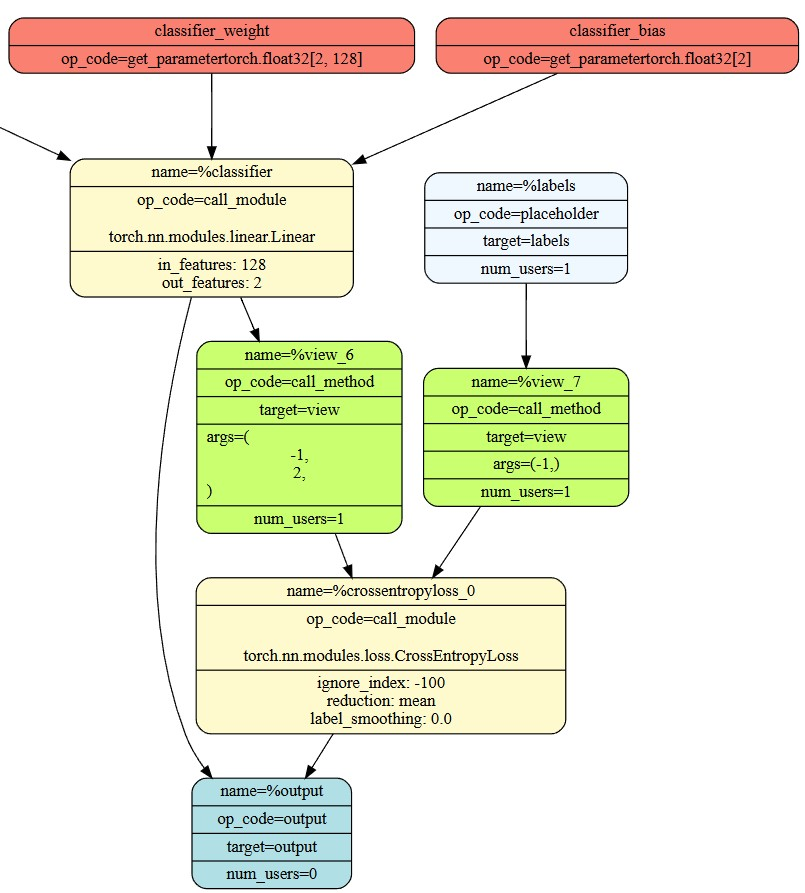
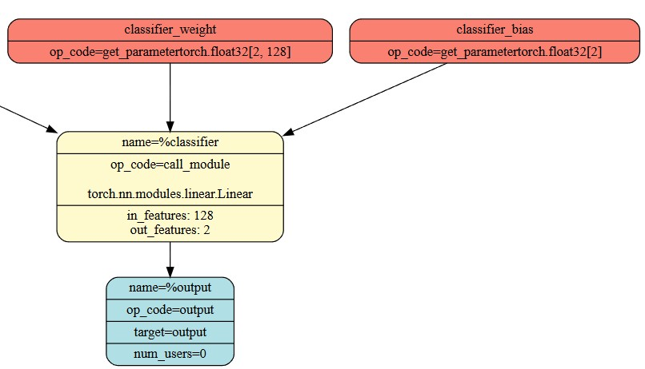

# ADLS Coursework 1

## Lab 0: Introduction to MASE

### Tutorial 1: Introduction to MASE

> **Task**:
> Delete the call to `replace_all_uses_with` to verify that FX will report a `RuntimeError`.

When writing transform passes, which can involve deleting / replacing nodes, we have to ensure we don't leave the graph in an invalid state - e.g. when deleting nodes, have to locate and update all nodes that use their output with `replace_all_uses_with`, otherwise may get a runtime error such as the following:

```plaintext
RuntimeError: Tried to erase Node bert_embeddings_dropout but it still had 6 users in the graph: {getattr_2: None, size_4: None, bert_encoder_layer_0_attention_self_query: None, bert_encoder_layer_0_attention_self_key: None, bert_encoder_layer_0_attention_self_value: None, add_7: None}!
```

### Tutorial 2: LoRA finetune

> **Task**:
> Remove the `attention_mask` and `labels` arguments from the `hf_input_names` list and re-run the following cell. Use `mg.draw()` to visualize the graph in each case. Can you see any changes in the graph topology? Can you explain why this happens?.

No `labels` argument meant there was no CrossEntropyLoss module at the end - need ground truth labels as reference to be able to compute loss. Final output is just the logits from classifier, whereas with with `labels`, output includes loss.

With no `attention_mask`, model assumes that all input positions are fully attended (no positions masked) - so replaced with node where the model generates a tensor filled with ones (`torch.ones`).

| With labels | Without labels |
| --- | --- |
|  |  |

## Lab 1: Model Compression (Quantization and Pruning)

